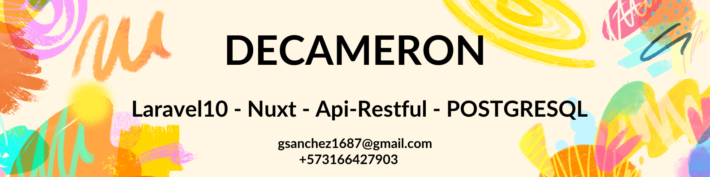
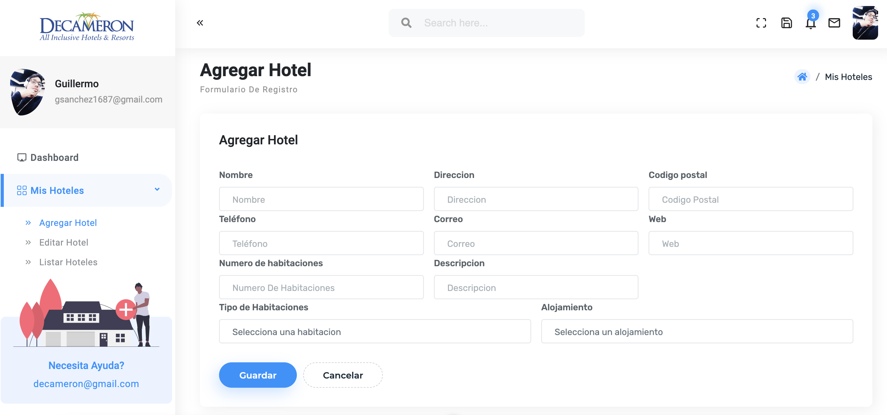
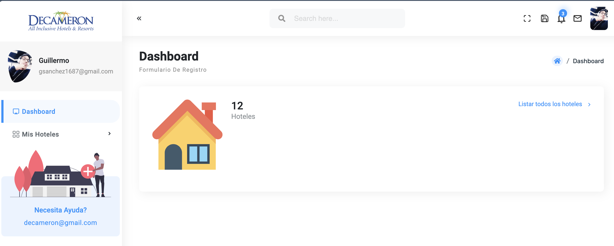

### Requisitos importantes
```
php v8.2
node v20
```

### Instalacion de la Api

#### PASO 1:
```
git clone https://github.com/gsanchez1687/DECAMERON.git
```

#### PASO 2:
```
En la carpeta de API, entrar y ejecutar este codigo

composer install
```

#### PASO 3:
```
En la misma carpeta de API, ejecutar este codigo para correr las migracioes de la DB y llenar las tablas catalogo

php artisan migrate --seed
```

#### PASO 4
```
Agregar Host
sudo nano /etc/hosts
127.0.0.1 decameron.local
```

#### PASO 5:

```
Ahora vamos a correr el proyecto API
php artisan serve --host='decameron.local' --port=8000
```

### Instalacion del Frontend

#### PASO 1

```
Vamos a la carpeta admin, ejecutamos este codigo para instala node en el proyecto
npm install
```

#### PASO 2
```
ejecutamos este codigo para correr el frontend
npm run dev
```